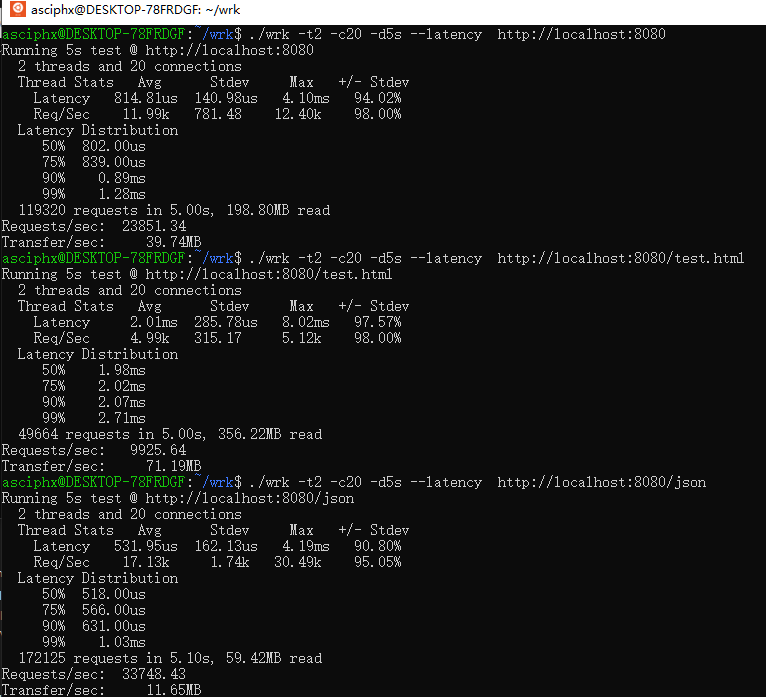


Crow is C++ microframework for web. Support Mac, Linux, windows, three platforms, the fastest development speed, the quickest and the strongest, the next step is to support ORM. At present, the performance of the framework should be ranked in the top five in the Techempower, and the self-test data may not be accurate enough.

### [Demo site(example_vs)](http://8.129.58.72:8080/)🚀
(inspired by Python Flask)[fork by Asciphx]

[](https://travis-ci.org/ipkn/crow)
[](https://coveralls.io/github/asciphx/Crow?branch=master)

```c++
#include "crow.h"
int main(){
    crow::SimpleApp app;
    CROW_ROUTE(app, "/")([](){
        return "Hello world";
    });
    app.port(18080).multithreaded().run();
}
```

## Features

 - Easy routing
   - Similiar to Flask
   - Type-safe Handlers (see Example)
 - Very Fast
   - 
   - More data on [crow-benchmark](https://github.com/ipkn/crow-benchmark)
 -  The third-party JSON parser [Nlohmann json](https://github.com/nlohmann/json) is used for static reflection and outputs JSON.
 - [Mustache](http://mustache.github.io/) based templating library (crow::mustache)
 - Header only
 - Provide an amalgamated header file [`crow_all.h`](https://github.com/ipkn/crow/releases/download/v0.1/crow_all.h) with every features ([Download from here](https://github.com/ipkn/crow/releases/download/v0.1/crow_all.h))
 - Middleware support
 - Websocket support
 - Support static resources and the default is in the 'static/' directory
 - Modular development, high efficiency, simple code
## Still in development
 - ~~Built-in ORM~~
   - Check [sqlpp11](https://github.com/rbock/sqlpp11) if you want one.
 - CORS is now allowed to be specially configured in 'config.h'
## Examples
#### sql query
```c++
  app.route("/sql")([] {
	auto q = d.conn();
	//std::tuple<int, std::string> ds=q("select id,name from users_test where id = 1").template r__<int,std::string>();
	//std::cout<<std::get<0>(ds)<<std::get<1>(ds);
	int i = 0; q("SELECT 200+2").r__(i);
	std::string s; q("SELECT 'hello world'").r__(s);
	return Res(i,s);
  });
```
#### Static reflection
```c++
  app.route("/list")([]() {
	List list=json::parse(R"({"user":{"is":false,"age":25,"weight":50.6,"name":"www","state":null},
            "userList":[{"is":true,"weight":52.0,"age":23,"state":true,"name":"wwzzgg"},
	    {"is":true,"weight":51.0,"name":"best","age":26}]})").get<List>();
	json json_output=json(list);
	return json_output;
  });
```
#### Server rendering
```c++
  app.default_route()([] {
	char name[64];gethostname(name,64);
	json j{{"servername",name}};
	return mustache::load("404NotFound.html").render(j);
  });
```

#### JSON Response
```c++
CROW_ROUTE(app, "/json")([]{
    crow::json x;
	x["message"]="Hello, World!";
	x["double"]=3.1415926;
	x["int"]=2352352;
	x["true"]=true;
	x["false"]=false;
	x["null"]=nullptr;
	x["bignumber"]=2353464586543265455;
    return x;
});
```

#### Arguments
```c++
CROW_ROUTE(app,"/hello/<int>")([](int count){
    if (count > 100) return crow::Res(400);
    std::ostringstream os;
    os << count << " bottles of beer!";
    return crow::Res(os.str());
});
```
Handler arguments type check at compile time
```c++
// Compile error with message "Handler type is mismatched with URL paramters"
CROW_ROUTE(app,"/another/<int>")([](int a, int b){
    return crow::Res(500);
});
```

#### Handling JSON Requests
```c++
CROW_ROUTE(app, "/add_json").methods("POST"_mt)
([](const crow::Req& req){
    auto x = crow::json::load(req.body);
    if (!x) return crow::Res(400);
	int sum=x["a"].get<int>()+x["b"].get<int>();
    std::ostringstream os;
    os << sum;
    return crow::Res{os.str()};
});
```

## How to Build

If you just want to use crow, copy amalgamate/crow_all.h and include it.

### Requirements
 - C++ compiler with good C++17 support (tested with g++>8.0)
 - Any version of boost library
 - CMake for build examples
 - Linking with tcmalloc/jemalloc is recommended for speed.
 - Now supporting VS2019 with limited functionality (only run-time check for url is available.)

### Building (Tests, Examples)
Out-of-source build with CMake is recommended.
```
mkdir build
cd build
cmake ..
make
```
You can run tests with following commands:
```
ctest
```
### Installing missing dependencies
#### Ubuntu
    sudo apt-get install build-essential libtcmalloc-minimal4 && sudo ln -s /usr/lib/libtcmalloc_minimal.so.4 /usr/lib/libtcmalloc_minimal.so
#### OSX
    brew install boost google-perftools
#### Windows
> first install boost  
> second modify CmakeLists.txt

##### CmakeLists.txt[example]
```cmake
SET(BOOST_ROOT "E:/Code/boost_1_75_0") #Installation address of decompressed version
set(Boost_USE_STATIC_LIBS ON) #Support anything else
```
### Attributions

Crow uses the following libraries.

    llhttp

    https://github.com/nodejs/llhttp

    Copyright Fedor Indutny, 2018.
    Permission is hereby granted, free of charge, to any person obtaining a
    copy of this software and associated documentation files (the
    "Software"), to deal in the Software without restriction, including
    without limitation the rights to use, copy, modify,  merge,    publish,
    distribute, sublicense, and/or sell copies of the Software, and to permit
    persons to whom the Software is furnished to do so,   subject   to the
    following conditions:
    
    The above copyright notice and this permission notice   shall   be included
    in all copies or substantial portions of the Software.
    
    THE SOFTWARE IS PROVIDED "AS IS", WITHOUT WARRANTY OF ANY KIND, EXPRESS
    OR IMPLIED, INCLUDING BUT NOT LIMITED TO THE WARRANTIES  OF
    MERCHANTABILITY, FITNESS FOR A PARTICULAR PURPOSE AND     NONINFRINGEMENT. IN
    NO EVENT SHALL THE AUTHORS OR COPYRIGHT HOLDERS BE LIABLE     FOR ANY CLAIM,
    DAMAGES OR OTHER LIABILITY, WHETHER IN AN ACTION OF     CONTRACT, TORT OR
    OTHERWISE, ARISING FROM, OUT OF OR IN CONNECTION WITH THE     SOFTWARE OR THE
    USE OR OTHER DEALINGS IN THE SOFTWARE.
    © 2021 GitHub, Inc.

    qs_parse

    https://github.com/bartgrantham/qs_parse

    Copyright (c) 2010 Bart Grantham
    Permission is hereby granted, free of charge, to any person obtaining a copy
    of this software and associated documentation files (the "Software"), to deal
    in the Software without restriction, including without limitation the rights
    to use, copy, modify, merge, publish, distribute, sublicense, and/or sell
    copies of the Software, and to permit persons to whom the Software is
    furnished to do so, subject to the following conditions:
    The above copyright notice and this permission notice shall be included in
    all copies or substantial portions of the Software.


    TinySHA1

    https://github.com/mohaps/TinySHA1

    TinySHA1 - a header only implementation of the SHA1 algorithm. Based on the implementation in boost::uuid::details

    Copyright (c) 2012-22 SAURAV MOHAPATRA mohaps@gmail.com
    Permission to use, copy, modify, and distribute this software for any purpose with or without fee is hereby granted, provided that the above copyright notice and this permission notice appear in all copies.
    THE SOFTWARE IS PROVIDED "AS IS" AND THE AUTHOR DISCLAIMS ALL WARRANTIES WITH REGARD TO THIS SOFTWARE INCLUDING ALL IMPLIED WARRANTIES OF MERCHANTABILITY AND FITNESS. IN NO EVENT SHALL THE AUTHOR BE LIABLE FOR ANY SPECIAL, DIRECT, INDIRECT, OR CONSEQUENTIAL DAMAGES OR ANY DAMAGES WHATSOEVER RESULTING FROM LOSS OF USE, DATA OR PROFITS, WHETHER IN AN ACTION OF CONTRACT, NEGLIGENCE OR OTHER TORTIOUS ACTION, ARISING OUT OF OR IN CONNECTION WITH THE USE OR PERFORMANCE OF THIS SOFTWARE.

    json 

    https://github.com/nlohmann/json

    Copyright (c) 2013-2021 Niels Lohmann
    Permission is hereby granted, free of charge, to any person obtaining a copy
    of this software and associated documentation files (the "Software"), to deal
    in the Software without restriction, including without limitation the rights
    to use, copy, modify, merge, publish, distribute, sublicense, and/or sell
    copies of the Software, and to permit persons to whom the Software is
    furnished to do so, subject to the following conditions:

    The above copyright notice and this permission notice shall be included in all
    copies or substantial portions of the Software.

    THE SOFTWARE IS PROVIDED "AS IS", WITHOUT WARRANTY OF ANY KIND, EXPRESS OR
    IMPLIED, INCLUDING BUT NOT LIMITED TO THE WARRANTIES OF MERCHANTABILITY,
    FITNESS FOR A PARTICULAR PURPOSE AND NONINFRINGEMENT. IN NO EVENT SHALL THE
    AUTHORS OR COPYRIGHT HOLDERS BE LIABLE FOR ANY CLAIM, DAMAGES OR OTHER
    LIABILITY, WHETHER IN AN ACTION OF CONTRACT, TORT OR OTHERWISE, ARISING FROM,
    OUT OF OR IN CONNECTION WITH THE SOFTWARE OR THE USE OR OTHER DEALINGS IN THE
    SOFTWARE.
